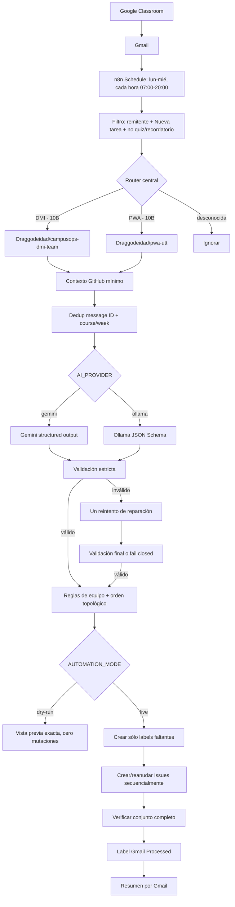

# Classroom → GitHub Issues (DMI y PWA)

Automatización self-hosted para detectar nuevas actividades de Google Classroom en Gmail, consultar el estado del repositorio, generar un plan validado de Issues y crearlas de forma idempotente. Empieza en `dry-run`; no modifica código, branches, commits, PRs, merges ni tags.

Estado de la investigación: **15 de septiembre de 2026**.

## Decisión ejecutiva

La arquitectura propuesta puede operar con **$0 MXN obligatorios al mes** si se ejecuta en una computadora existente y se mantiene dentro de las capas gratuitas. No requiere VPS, n8n Cloud, base de datos externa ni una API de IA de pago.

| Componente | Clasificación | Costo obligatorio para este caso | Fuente oficial |
|---|---|---:|---|
| n8n Community self-hosted | Fair-code/source-available, Sustainable Use License; no es OSI open source | $0 | [n8n docs](https://docs.n8n.io/), [licencia](https://docs.n8n.io/sustainable-use-license/) |
| Docker Engine/Compose | Software libre para este despliegue en Linux | $0 | [Docker Engine](https://docs.docker.com/engine/) |
| Gmail API | Servicio con cuota; el uso estándar bajo el umbral no tiene costo adicional | $0 en este volumen | [cuotas y pricing](https://developers.google.com/workspace/gmail/api/reference/quota) |
| GitHub | SaaS con GitHub Free; repositorios públicos/privados e Issues disponibles | $0 | [planes de GitHub](https://docs.github.com/en/get-started/learning-about-github/githubs-plans) |
| Gemini API | SaaS Free Tier; `gemini-2.5-flash` tiene entrada/salida gratuita dentro de límites | $0 dentro del Free Tier | [pricing](https://ai.google.dev/gemini-api/docs/pricing), [límites](https://ai.google.dev/gemini-api/docs/rate-limits) |
| Ollama | MIT, ejecución local; los modelos tienen sus propias licencias | $0 | [licencia](https://github.com/ollama/ollama/blob/main/LICENSE), [structured outputs](https://docs.ollama.com/capabilities/structured-outputs) |

La energía y el hardware local ya existentes no se contabilizan como una suscripción. Gemini no tiene un SLA gratuito y sus límites pueden cambiar; Ollama conserva una ruta completamente local.

## Arquitectura



## Por qué Schedule Trigger

Ambas opciones son gratuitas y el Gmail Trigger de n8n también es un poller configurable ([documentación oficial](https://docs.n8n.io/integrations/builtin/trigger-nodes/n8n-nodes-base.gmailtrigger/)).

| Criterio | Gmail Trigger | Schedule + Gmail Search |
|---|---|---|
| Nuevos mensajes | Muy simple | Simple |
| Ventana lun–mié | Posible, menos explícita | Cron claro |
| Backfill/manual de Semana 03 | Menos cómodo | Natural con `newer_than` y ejecución manual |
| Exclusión por label | Debe configurarse en la consulta del trigger | Visible en una sola consulta Gmail |
| Diagnóstico | Estado de polling implícito | Cada búsqueda queda en el log |

Se eligió **Schedule + Gmail Search** cada 60 minutos de 07:00 a 20:00, lunes a miércoles. Para cambiar a 30 minutos usa `*/30 7-20 * * 1-3` en el nodo Schedule.

## Idempotencia y transacción lógica

1. Gmail excluye `Automation/Classroom/Processed` y sólo aplica esa label después de verificar todas las Issues.
2. Cada Issue contiene metadata invisible con `classroom-message-id`, `course`, `week`, `issue-key` y `plan-keys`.
3. Antes del LLM se buscan coincidencias tanto por message ID como por materia/semana.
4. Los correos candidatos se procesan de uno en uno dentro de cada ejecución; una actividad nunca comparte estado de creación con otra.
5. Si el conjunto está completo, no se recrea: en `live` sólo se reconcilia la label Gmail faltante.
6. Si hubo fallo parcial, `plan-keys` obliga al LLM a conservar exactamente las mismas keys. El loop reconstruye `key → #número`, vuelve a consultar GitHub inmediatamente antes de cada creación, salta Issues existentes y crea sólo las faltantes.
7. La creación es secuencial y topológica; las referencias simbólicas se sustituyen por `#número` real.
8. Ciclos, JSON inválido, repo/semana incorrectos o reparto inválido detienen el proceso antes de crear Issues.

GitHub Issues no ofrece transacciones ACID. Esta estrategia usa compensación por reanudación, no borrado: las Issues ya creadas se conservan y el siguiente intento completa el conjunto.

## Contexto enviado al LLM

Se consultan: metadata/default branch, hasta 100 Issues recientes, Issues abiertas y cerradas recientes, búsquedas de deduplicación, PRs abiertos, labels, árbol de rutas relevante y README. No se envía el repositorio completo. El árbol se filtra a documentación, configuración, código y pruebas, con máximo de 80 rutas; el README se limita a 12,000 caracteres.

## Gemini vs Ollama

| Aspecto | Gemini 2.5 Flash | Ollama + qwen2.5-coder:7b |
|---|---|---|
| Costo | Free Tier, sujeto a límites | Local, sin costo por llamada |
| Calidad | Mejor default para planificación y español | Depende mucho de RAM/CPU/GPU |
| JSON | Structured output nativo | JSON Schema nativo; modelos pequeños pueden fallar más |
| Privacidad | En el Free Tier el contenido puede usarse para mejorar productos | El contenido permanece local |
| Disponibilidad | Requiere Internet/servicio de Google | Requiere que la computadora esté encendida y Ollama activo |
| Operación | Muy sencilla | Descarga de modelo de ~4.7 GB y consumo local |

Default: **Gemini**, por calidad, structured output y ausencia de requisitos de hardware. Fallback: **Ollama**, preferible si los correos o el repositorio contienen información que no debe salir del equipo. La página de pricing de Gemini advierte que en Free Tier el contenido se usa para mejorar productos; no envíes secretos ni datos sensibles.

## Inicio rápido

1. Copia `.env.example` a `.env`, genera `N8N_ENCRYPTION_KEY` y deja `AUTOMATION_MODE=dry-run`.
2. Inicia n8n: `docker compose up -d`.
3. Abre `http://localhost:5678` y crea la cuenta local de propietario.
4. Sigue [SETUP-GMAIL.md](docs/SETUP-GMAIL.md), [SETUP-GITHUB.md](docs/SETUP-GITHUB.md) y [SETUP-AI.md](docs/SETUP-AI.md).
5. Importa `workflows/classroom-error-handler.json` y luego `workflows/classroom-to-github.json`.
6. En ambos workflows selecciona las credenciales que creaste. En el principal, ve a **Settings → Error workflow** y elige `Classroom to GitHub - Error Handler`.
7. En Gmail crea manualmente la label anidada `Automation/Classroom/Processed`.
8. Ejecuta primero **Manual Dry Run** y revisa el último nodo `Exact Dry-Run Preview`.
9. Activa el workflow sólo después de aprobar las pruebas.

El workflow importado está inactivo intencionalmente. Las credenciales no están incluidas en los JSON.

## Archivos

```text
automation/
├── docker-compose.yml
├── .env.example
├── README.md
├── src/                          # fuente auditable de los Code Nodes, por dominio
│   ├── gmail/                    # ingesta y enrutado de correos
│   ├── github/                   # contexto de repo, labels, Issues y verificación
│   ├── ai/                       # normalización y validación del plan generado
│   ├── planning/                 # orden topológico y cola de Issues
│   ├── reporting/                # resúmenes y notificaciones
│   └── glue/                     # nodos de enlace entre fases
├── workflows/
│   ├── classroom-to-github.json
│   └── classroom-error-handler.json
├── prompts/
│   └── issue-planner.md
├── schemas/
│   └── issue-plan.schema.json
├── docs/
│   ├── SETUP-GMAIL.md
│   ├── SETUP-GITHUB.md
│   ├── SETUP-AI.md
│   └── TESTING.md
├── tests/
└── tools/
    └── build-workflows.mjs
```

## Seguridad y límites

- `127.0.0.1:5678` evita exponer n8n a la red por defecto. Para acceso remoto usa HTTPS mediante un reverse proxy y actualiza las cuatro URLs de n8n.
- El volumen Docker conserva la base SQLite interna, workflows y credenciales cifradas. No se añade PostgreSQL/Redis.
- El contenedor elimina capabilities y activa `no-new-privileges`.
- No guardes tokens en `.env` para este proyecto: Gmail, GitHub y Gemini se almacenan cifrados en n8n Credentials.
- La label Gmail se aplica antes del correo de éxito. Si falla sólo la notificación, la actividad ya está correctamente procesada y no se duplicará.
- GitHub puede tardar en indexar Search; la verificación final usa `GET /repos/{owner}/{repo}/issues`, no el índice de búsqueda.

## Actualización controlada

La imagen se fija en `2.39.5`, estable el 14-09-2026. Revisa [releases oficiales](https://github.com/n8n-io/n8n/releases), cambia el tag explícitamente, respalda el volumen y vuelve a ejecutar las pruebas. No uses `latest` en producción.
