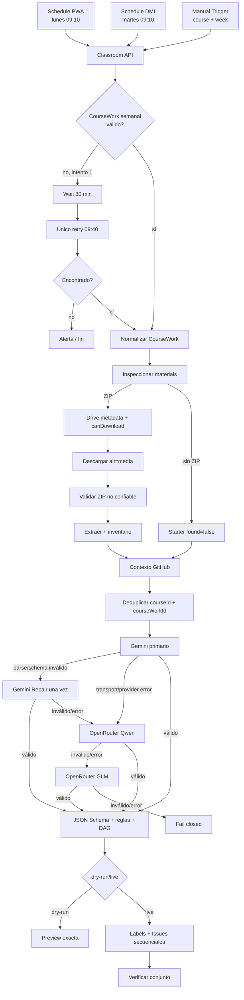

# Classroom API → GitHub Issues (DMI y PWA)

Automatización n8n self-hosted que lee actividades publicadas de Google Classroom, analiza de forma segura el starter ZIP de Google Drive, contrasta el repositorio y genera un plan validado de GitHub Issues. Gmail ya no es una entrada; sólo puede enviar notificaciones opcionales.

## Arquitectura



El LLM se invoca sólo después de reunir tres fuentes:

1. CourseWork de Classroom: qué pide el profesor.
2. Starter real de Drive: cómo debe implementarse o verificarse.
3. Estado actual de GitHub: qué existe y qué debe preservarse.

## Comportamiento operativo

- PWA: lunes a las 09:10, `America/Mexico_City`.
- DMI: martes a las 09:10, `America/Mexico_City`.
- Si no hay actividad válida, espera 30 minutos y consulta una sola vez más.
- No hay polling continuo ni `courses.list` semanal.
- La consulta usa `PUBLISHED`, `updateTime desc`, `pageSize=5` y partial response.
- Los títulos `Semana 03`, `[Semana 03]` y variantes razonables se normalizan como `W03`.
- Quiz, examen y recordatorio se excluyen antes del LLM.
- Si la semana no es determinable, el flujo falla cerrado.

## Idempotencia

GitHub es la fuente persistente principal. Cada Issue contiene:

```html
<!-- automation:classroom -->
<!-- classroom-course-id:COURSE_ID -->
<!-- classroom-coursework-id:COURSEWORK_ID -->
<!-- classroom-update-time:UPDATE_TIME -->
<!-- course:PWA -->
<!-- week:03 -->
<!-- issue-key:service-worker -->
<!-- starter:PWA-w03-kit-estudiante.zip -->
<!-- plan-keys:foundation,core,offline-tests,final -->
```

- Conjunto completo: termina como `already_processed` sin duplicar.
- Conjunto parcial: reconstruye `issue-key → #Issue` y crea sólo lo faltante.
- `updateTime` posterior: termina como `coursework_updated`, no modifica Issues y solicita revisión.
- Otra identidad para la misma materia/semana o metadata incompleta: falla cerrado para evitar duplicados.
- La creación sigue orden topológico y reconsulta GitHub antes de cada Issue.

## Starter y seguridad

El ZIP se trata como entrada no confiable. Antes de extraer se valida firma y directorio central, y se rechazan:

- rutas absolutas, `..` y Zip Slip;
- symlinks;
- ZIP cifrado;
- más de 500 archivos;
- ZIP mayor de 25 MB;
- extracción mayor de 100 MB;
- archivo individual mayor de 10 MB;
- ratio de compresión mayor de 100:1.

Los límites se configuran por `.env`. El analizador prioriza instrucciones, rúbrica, README, `package.json`, Makefile, workflows, tests y configuración. No envía automáticamente todo el ZIP al LLM. Los binarios usan almacenamiento temporal de n8n; las ejecuciones exitosas no guardan datos y los errores se podan a las 24 horas.

## Foundation y equipo

Cuando existe ZIP, el workflow agrega determinísticamente:

```text
[<MATERIA>][WXX] Preparar <starter.zip> y establecer baseline de trabajo
```

asignada a `Draggodeidad`, sin dependencias y basada en datos reales del starter. La entrega final también pertenece al owner. Ambas tienen peso funcional cero; el resto se asigna después del orden topológico según dificultad, riesgo, capacidades y carga ponderada. Consulta [el reporte de asignación y grounding](docs/ASSIGNMENT-GROUNDING-REPORT.md).

## Inicio rápido

1. Copia `.env.example` a `.env`, genera `N8N_ENCRYPTION_KEY` y conserva `AUTOMATION_MODE=dry-run`.
2. Sigue [SETUP-CLASSROOM.md](docs/SETUP-CLASSROOM.md) y [SETUP-DRIVE.md](docs/SETUP-DRIVE.md).
3. Configura [GitHub](docs/SETUP-GITHUB.md), Gemini y OpenRouter en [SETUP-AI.md](docs/SETUP-AI.md).
4. Inicia n8n con `docker compose up -d`.
5. Importa primero `workflows/classroom-error-handler.json` y luego `workflows/classroom-to-github.json`.
6. Asigna las credenciales nombradas en los nodos y selecciona el error workflow en Settings.
7. Revisa [SCHEDULING.md](docs/SCHEDULING.md) y ejecuta los [dry-runs W03](docs/DRY-RUN-EXAMPLES.md).
8. Conserva `AUTOMATION_MODE=dry-run`: la capa LLM incluye un bloqueo de revisión que fuerza dry-run. Retirarlo requiere una revisión posterior explícita.

El workflow importado está inactivo intencionalmente y no contiene credenciales.

## Manual Trigger

El nodo `Manual Request` contiene un objeto editable:

```js
const request = { course: 'PWA', week: 3 };
```

Cámbialo a `DMI` o a otra semana antes de ejecutar `Manual Trigger`. Esto no modifica los cron automáticos.

## Variables principales

Consulta `.env.example`. Los IDs de curso se resuelven una sola vez durante setup y luego se usan directamente. Tokens OAuth, token GitHub y claves de Gemini/OpenRouter se guardan en Credentials cifradas de n8n, no en `.env`.

n8n 2.x bloquea `$env` en Code Nodes por defecto. Este despliegue establece `N8N_BLOCK_ENV_ACCESS_IN_NODE=false` porque los módulos leen IDs, límites y modo desde el entorno. Úsalo sólo en esta instancia confiable de un único propietario; los secretos continúan en Credentials y no se exponen por `$env`.

## Desarrollo y pruebas

```bash
npm run build
npm test
```

`build` regenera los dos JSON importables desde los módulos auditables de `src/`. `test` valida sintaxis, cron, ausencia de polling, routing, filtros Classroom, adjuntos, permisos Drive, ZIP Slip, compression bomb, Foundation, actualización de CourseWork, secretos y Compose. Consulta [TESTING.md](docs/TESTING.md).

## Límites deliberados

- No modifica Classroom, código, branches, commits, PRs, merges ni tags.
- No agrega PostgreSQL, Redis, Supabase, Kafka ni servicios externos de estado.
- No reconcilia automáticamente cambios sustanciales de un CourseWork ya procesado.
- Si dos ZIP tienen igual relevancia, no elige arbitrariamente: falla cerrado.
- Gmail, cuando se habilita, es sólo salida de éxito/error/revisión.
